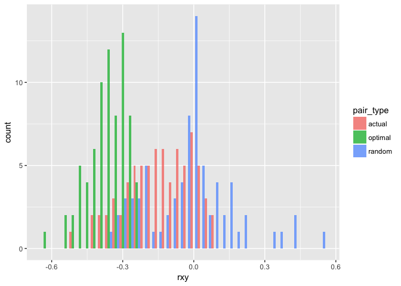

CohoBroodstock
================
26 February, 2019

<!-- README.md is generated from README.Rmd. Please edit that file -->

The goal of CohoBroodstock is to put a bunch of useful functions into
one place to expedite Libby’s coho broodstock management work.

# Installing

If you don’t already have the `devtools` package, then do:

``` r
install.packages("devtools")
```

Then use it to install this from GitHub:

``` r
devtools::install_github("eriqande/CohoBroodstock")
```

You also have to get the `related` package installed from R-forge. That
requires some gfortran compilation. We did that for Libby already.

# Preparing Spawning matrices

This is set up now to use the *related* package to compute the Rxy’s.  
Input is a typical two-column format:

  - First column holds the individual IDs
  - Every two columns after that are one locus.
  - The file must have a row of column headers

The steps are:

1.  first, make sure to load the package (and you might as well load the
    tidyverse too…)
    
    ``` r
    library(tidyverse)
    library(CohoBroodstock)
    ```

2.  read in the file and compute Rxy with computeRxy()
    
    ``` r
    # get path to the example genotype file
    # (typically you would pass it the path to your own file)
    geno_file <- system.file("extdata",
                     "WSH_W1718_v5_two_column_data.txt.gz",
                     package = "CohoBroodstock")
    
    # compute rxy.  This returns a tibble
    rxy <- computeRxy(geno_file)
    #>    user  system elapsed 
    #>   9.804   0.398  10.334 
    #> 
    #> Reading output files into data.frames... Done!
    ```

3.  prepare the spawning matrix from the ouput of the last command using
    spawning\_matrix(). Like this:
    
    ``` r
    spawning_matrix(Rxy_tidy = rxy)
    ```

This creates, by default, two files named `spawn_matrix.csv` and
`spawn_matrix_full.csv` in the current working directory.

# Actual vs Optimal vs Random Relatedness

Here is how it goes. We will show it from the genotype
stage.

``` r
geno_path <- system.file("extdata/IGH_W1819_geno_aor.txt", package = "CohoBroodstock")

rxys <- computeRxy(geno_path)
#>    user  system elapsed 
#>   1.778   0.167   2.059 
#> 
#> Reading output files into data.frames... Done!
```

Here is what the first few rows of that look like

``` r
rxys[1:10, ]
#> # A tibble: 10 x 3
#>    ind1  ind2   quellergt
#>    <chr> <chr>      <dbl>
#>  1 F_01F F_02F     0.013 
#>  2 F_01F F_04F    -0.0304
#>  3 F_01F F_05F     0.574 
#>  4 F_01F F_07FN   -0.0806
#>  5 F_01F F_08F    -0.0249
#>  6 F_01F F_10F     0.0266
#>  7 F_01F F_11F     0.183 
#>  8 F_01F F_12F     0.0612
#>  9 F_01F F_13F    -0.0127
#> 10 F_01F F_15F    -0.181
```

Then we need to read in the actual spawn pairs. This should be two
columns: the first one named Female and then
Male:

``` r
pairs_file <- system.file("extdata/IGH--W1819--actual_spawn_pairs.csv", package = "CohoBroodstock")
actual_pairs <- read_csv(pairs_file)
```

This looks like this:

``` r
actual_pairs[1:10, ]
#> # A tibble: 10 x 2
#>    Female Male  
#>    <chr>  <chr> 
#>  1 F_01F  M_17M 
#>  2 F_01F  M_29MJ
#>  3 F_02F  M_38MJ
#>  4 F_02F  M_39M 
#>  5 F_04F  M_10MN
#>  6 F_04F  M_11M 
#>  7 F_05F  M_10MN
#>  8 F_05F  M_12M 
#>  9 F_08F  M_23MJ
#> 10 F_08F  M_28M
```

Now, in order to use the function `aor_pairs()` we need to format the
`rxys` tibble a little bit. We need to only keep the individuals
starting with “F” and those starting with “M”, we need to keep only
comparisons between males and females, and we need to name the columns
“Female”, “Male”, and “rxy”. We do that with the
`clean_computeRxy_output()` function.

``` r
rxy_clean <- clean_computeRxy_output(rxys)
```

The result looks like this:

``` r
rxy_clean[1:10,]
#> # A tibble: 10 x 3
#>    Female Male        rxy
#>    <chr>  <chr>     <dbl>
#>  1 F_01F  M_01M   -0.173 
#>  2 F_01F  M_02M    0.544 
#>  3 F_01F  M_04MJ  -0.168 
#>  4 F_01F  M_05MJ  -0.058 
#>  5 F_01F  M_06M    0.0978
#>  6 F_01F  M_07M    0.357 
#>  7 F_01F  M_08MJ  -0.0333
#>  8 F_01F  M_09M    0.139 
#>  9 F_01F  M_100M  -0.196 
#> 10 F_01F  M_101MJ -0.0522
```

Before we feed these values int `aor_pairs` we have to remove Female
F\_7FN in `actual_pairs` because it is named incorrectly (I think: there
is an F\_07FN in the rxys file. `aor_pairs` barks an error about that.)

``` r
actual_pairs_corrected <- actual_pairs %>%
  filter(Female != "F_7FN")
```

Then we feed the actual values and all the values into the `aor_pairs`
function.

``` r
set.seed(10)  # set a random number seed for reproducibility
AOR <- aor_pairs(actual_pairs_corrected, rxy_clean)

# have a look at it:
AOR
#> # A tibble: 333 x 5
#>    Female Male   `Spawn Pairs`   idx     rxy
#>    <chr>  <chr>  <chr>         <int>   <dbl>
#>  1 F_01F  M_17M  Actual            1 -0.021 
#>  2 F_01F  M_29MJ Actual            2 -0.164 
#>  3 F_01F  M_12M  Optimal           1 -0.281 
#>  4 F_01F  M_53MJ Optimal           2 -0.403 
#>  5 F_01F  M_41M  Random            1 -0.0333
#>  6 F_01F  M_18M  Random            2  0.468 
#>  7 F_02F  M_38MJ Actual            1 -0.192 
#>  8 F_02F  M_39M  Actual            2 -0.176 
#>  9 F_02F  M_73MJ Optimal           1 -0.260 
#> 10 F_02F  M_97MJ Optimal           2 -0.266 
#> # … with 323 more rows
```

Then plot those values in a histogram:

``` r
cols <- c(Actual = "gold", Optimal = "limegreen", Random = "steelblue1")
ggplot(AOR, aes(x =  rxy, fill = `Spawn Pairs`)) +
  geom_histogram(position = "dodge", alpha = 0.75, binwidth = 0.03, color = "black", size = 0.2) +
  scale_fill_manual(values = cols)
```

<!-- -->
