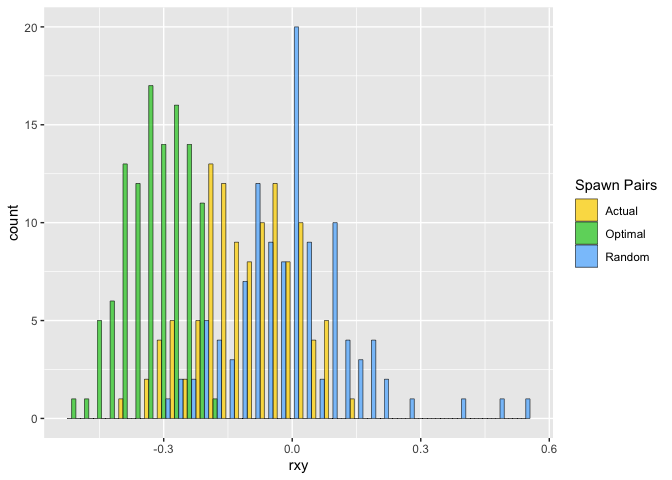

CohoBroodstock
================
04 February, 2019

<!-- README.md is generated from README.Rmd. Please edit that file -->

The goal of CohoBroodstock is to put a bunch of useful functions into
one place to expedite Libby’s coho broodstock management work.

# Installing

If you don’t already have the `devtools` package, then do:

``` r
install.packages("devtools")
```

Then use it to install this from GitHub:

``` r
devtools::install_github("eriqande/CohoBroodstock")
```

You also have to get the `related` package installed from R-forge. That
requires some gfortran compilation. We did that for Libby already.

# Preparing Spawning matrices

This is set up now to use the *related* package to compute the Rxy’s.  
Input is a typical two-column format:

  - First column holds the individual IDs
  - Every two columns after that are one locus.
  - The file must have a row of column headers

The steps are:

1.  first, make sure to load the package (and you might as well load the
    tidyverse too…)
    
    ``` r
    library(tidyverse)
    library(CohoBroodstock)
    ```

2.  read in the file and compute Rxy with computeRxy()
    
    ``` r
    # get path to the example genotype file
    # (typically you would pass it the path to your own file)
    geno_file <- system.file("extdata",
                     "WSH_W1718_v5_two_column_data.txt.gz",
                     package = "CohoBroodstock")
    
    # compute rxy.  This returns a tibble
    rxy <- computeRxy(geno_file)
    #>    user  system elapsed 
    #>   9.804   0.398  10.334 
    #> 
    #> Reading output files into data.frames... Done!
    ```

3.  prepare the spawning matrix from the ouput of the last command using
    spawning\_matrix(). Like this:
    
    ``` r
    spawning_matrix(Rxy_tidy = rxy)
    ```

This creates, by default, two files named `spawn_matrix.csv` and
`spawn_matrix_full.csv` in the current working directory.

# Actual vs Optimal vs Random Relatedness

Here is how it goes. First, read the symmetrical full matrix of rxy
values:

``` r
file_path <- system.file("extdata/IGH_W1718_master_Kinsh_res.txt.gz", package = "CohoBroodstock")

rxys <- read_kinship_matrix(file_path)
```

Here is what the first few rows of that look like

``` r
rxys[1:10, ]
#> # A tibble: 10 x 3
#>    Female Male       rxy
#>    <chr>  <chr>    <dbl>
#>  1 F_01F  M_01MJ -0.101 
#>  2 F_02F  M_01MJ -0.0381
#>  3 F_04F  M_01MJ -0.142 
#>  4 F_05F  M_01MJ -0.264 
#>  5 F_06F  M_01MJ  0.0185
#>  6 F_07F  M_01MJ -0.0649
#>  7 F_09F  M_01MJ -0.0411
#>  8 F_10FN M_01MJ  0.246 
#>  9 F_11F  M_01MJ  0.158 
#> 10 F_12FN M_01MJ -0.0237
```

Then we need to read in the actual spawn pairs. This should be two
columns: first Female and then
Male:

``` r
pairs_file <- system.file("extdata/IGH_W1718_actual_spawn_pairs.csv", package = "CohoBroodstock")
actual_pairs <- read_csv(pairs_file)
```

This looks like this:

``` r
actual_pairs[1:10, ]
#> # A tibble: 10 x 2
#>    Female Male  
#>    <chr>  <chr> 
#>  1 F_01F  M_14MJ
#>  2 F_01F  M_21MJ
#>  3 F_02F  M_46M 
#>  4 F_02F  M_41MJ
#>  5 F_04F  M_15M 
#>  6 F_04F  M_17MJ
#>  7 F_05F  M_06M 
#>  8 F_05F  M_08MJ
#>  9 F_06F  M_09MJ
#> 10 F_06F  M_27M
```

Then we get the Rxy’s of the actual spawn pairs, and alsothe same number
of Optimal-mate Rxys, and the same number of Random-mate Rxys:

``` r
set.seed(10)  # set a random number seed for reproducibility
AOR <- aor_pairs(actual_pairs, rxys)

# have a look at it:
AOR
#> # A tibble: 225 x 5
#>    Female Male    `Spawn Pairs`   idx     rxy
#>    <chr>  <chr>   <chr>         <int>   <dbl>
#>  1 F_01F  M_14MJ  Actual            1 -0.153 
#>  2 F_01F  M_21MJ  Actual            2 -0.269 
#>  3 F_01F  M_52M   Optimal           1 -0.396 
#>  4 F_01F  M_nb002 Optimal           2 -0.295 
#>  5 F_01F  M_31MJ  Random            1 -0.0130
#>  6 F_01F  M_19MJ  Random            2 -0.0382
#>  7 F_02F  M_46M   Actual            1 -0.0493
#>  8 F_02F  M_41MJ  Actual            2  0.0181
#>  9 F_02F  M_17MJ  Optimal           1 -0.301 
#> 10 F_02F  M_nb002 Optimal           2 -0.345 
#> # … with 215 more rows
```

Then plot those values in a histogram:

``` r
cols <- c(Actual = "gold", Optimal = "limegreen", Random = "steelblue1")
ggplot(AOR, aes(x =  rxy, fill = `Spawn Pairs`)) +
  geom_histogram(position = "dodge", alpha = 0.75, binwidth = 0.03, color = "black", size = 0.2) +
  scale_fill_manual(values = cols)
```

<!-- -->
